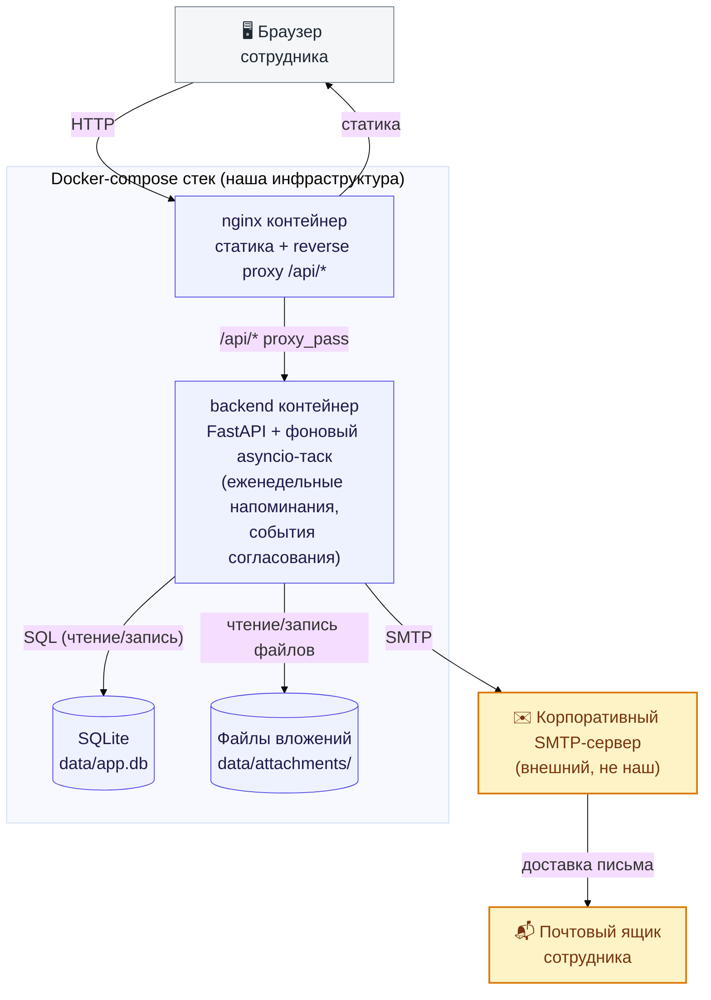

# Схема

*(синий — наш docker-compose стек; жёлтый — внешние системы вне нашего контроля)*

## Стек

Backend: Python 3.11, FastAPI, SQLAlchemy (ORM), SQLite (файл на диске), Uvicorn (ASGI), openpyxl (Excel), python-multipart (загрузка файлов). 

БД — SQLite встроен в backend-контейнер.

Frontend: чистый JS/HTML/CSS, без фреймворка и без сборки — один файл script.js. Графики — на <canvas>, самописные, без библиотек.

Инфраструктура: nginx (отдаёт статику + проксирует /api/*), Docker/docker-compose (2 контейнера: backend, frontend).