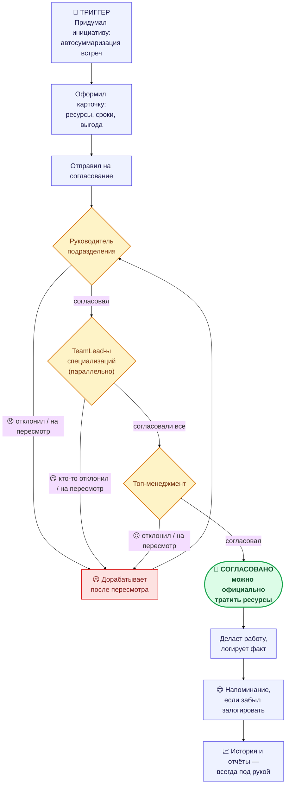

# CJM: AI-чемпион — от идеи до реализации инициативы

**Роль:** AI-чемпион
**Триггер:** чемпион придумал инициативу по внедрению автосуммаризации встреч и хочет довести её
от идеи до реального результата.
**Точка отсчёта «было»:** процесс велся в Google-таблице (см. `QA.md`) — вручную, без единого
формата, без автоматических уведомлений и без видимости для самого чемпиона, что происходит с его
инициативой дальше.

---

## Схема пути

*(жёлтый — ожидание решения; красный — точка боли (пересмотр/доработка); зелёный — пиковый момент
ценности; синий — нейтральные рабочие шаги)*

---

## Путь по шагам

| Этап | Шаг чемпиона | Точка боли | Что даёт продукт | Момент ценности |
|---|---|---|---|---|
| **Триггер** | Придумал идею: автосуммаризация встреч сэкономит часы сотрудников. | Раньше — нужно было понять, куда и в каком формате это вообще заносить, чтобы не потерялось. | Единая точка входа: раздел «Мои инициативы» → «+ Новая инициатива», понятный обязательный набор полей. | — |
| **Оформление** | Заполняет название, описание, сроки; указывает плановые человеко-часы (например, ML-инженер, Разработчик) и технические ресурсы; указывает ожидаемую выгоду (сколько часов/денег сэкономит в месяц). | В таблице пришлось бы вручную прикидывать стоимость в деньгах — никто не считает ₽/час на лету. | Портал сам считает денежную оценку по ставкам, которые задал PM (раздел «Ресурсы и ставки») — стоимость и окупаемость видны сразу, без калькулятора. | Чемпион впервые видит **предварительную окупаемость** своей идеи — может её поправить ещё до отправки. |
| **Отправка на согласование** | Нажимает «Создать» — инициатива уходит руководителю подразделения. | «Чемпион вынужден всё время бегать за руководителем, согласовывать изменения, питчить инициативы» (QA.md). | Автоматическая маршрутизация + уведомление руководителю. Чемпиону больше не нужно лично идти и просить посмотреть. | Чемпион **«отпускает» инициативу** — дальше система, а не он, следит, чей сейчас ход. |
| **Ожидание решения руководителя** | Ждёт, периодически проверяет статус карточки. | Точка боли: ожидание есть и в новом процессе — согласование не мгновенное, чемпион по-прежнему пассивен на этом шаге. | Статус-бейдж в карточке всегда актуален («Ожидает согласования руководителя»), не нужно никому писать «ну как там». | — |
| **Пересмотр (если руководителя что-то не устроило)** | Получает уведомление с комментарием-причиной, правит ресурсы/сроки, повторно отправляет. | Раньше причина отказа могла затеряться в переписке — «требуется время, чтобы поднять переписки и вспомнить все решения» (QA.md). | Комментарий с причиной хранится в карточке навсегда; при повторной отправке в истории согласований автоматически фиксируется, что именно изменилось (ресурс/количество). | Чемпион может **исправить именно то, что просили**, не гадая и не переспрашивая. |
| **Согласование TeamLead-ами** | Ждёт — если в инициативе есть специализации вроде ML-инженера, согласование уходит их TeamLead-ам параллельно. | Раньше этого слоя контроля не было вовсе — ресурс мог быть выделен «на словах» и не подтверждён по факту. | Чемпион видит в карточке, кто уже согласовал, а кого ещё ждут — прозрачность вместо чёрного ящика. | Чемпион видит, что **конкретные владельцы ресурсов реально подтвердили** готовность выделить людей. |
| **Финальное согласование топ-менеджментом** | Получает уведомление «инициатива полностью согласована». | Раньше — «топ-менеджмент находится в неведении», а значит и чемпион никогда не знал наверняка, дошла ли идея до реального решения на самом верху. | Явный, недвусмысленный финальный статус «Согласовано» — весь путь инициативы задокументирован и виден в истории. | **Пиковый момент ценности.** Чемпион получает чёткий зелёный свет: можно официально тратить ресурсы, есть с чем идти к команде. |
| **Реализация** | Делает работу: настраивает автосуммаризацию встреч. | — | — | Ценность подтверждается на практике — чемпион видит, что не потратил время на «висящую в воздухе» инициативу. |
| **Логирование факта** | Заходит в карточку, вносит фактически потраченные часы по специализации. | Раньше — «чемпионы вынуждены где-то накапливать историю работ и руками обновлять таблицу», легко забыть. | Раз в неделю (по умолчанию четверг) приходит напоминание в «Уведомлениях», если часы не залогированы; система не даст залогировать больше плана — меньше ручных ошибок. | Чемпион **не думает о трекинге сам** — портал напоминает вовремя. |
| **Итог / история** | При необходимости (ревью с руководителем, вопрос от PM) открывает карточку или выгружает отчёт. | Раньше отчётность собиралась вручную под каждый запрос. | Вся история (согласования, переписка, файлы, факт/план по ресурсам) — в одной карточке; отчёт по своим инициативам — кнопка «Отчёты», Excel/CSV с готовыми фильтрами. | Подготовка к любому разговору о статусе инициативы занимает **секунды, а не отдельную задачу**. |

---

## Что осталось болью и в новом продукте (честно)

- **Ожидание на каждом этапе согласования по-прежнему реально** — продукт не ускоряет решение
  людей, только убирает ручную беготню и делает ожидание прозрачным.
- **Правки чемпион по-прежнему вносит вручную** — продукт не подсказывает, как исправить
  инициативу, только фиксирует, что именно попросили поменять.
