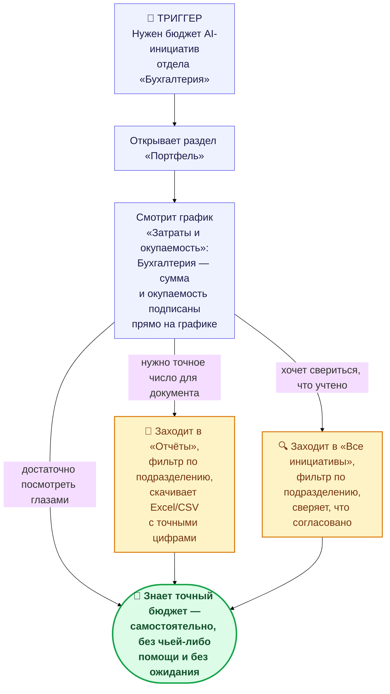

# CJM: Топ-менеджер — узнать бюджет AI-инициатив подразделения

**Роль:** Топ-менеджмент
**Триггер:** топ-менеджеру нужно узнать, какой бюджет заложен на AI-инициативы для отдела
«Бухгалтерия» (например, перед обсуждением бюджета).
**Точка отсчёта «было»:** по `QA.md` — «топ-менеджмент находится в неведении относительно того, на
каком этапе находятся инициативы, какие затраты и какую выгоду принесёт реализация всего скопа
инициатив»; получить актуальный ответ можно было только «через отдельную задачу, на которую будут
потрачены ресурсы» — то есть попросить кого-то (PM или чемпиона) сесть и вручную посчитать по
таблице.

---

## Схема пути

*(синий — основной путь; жёлтый — необязательные, но частые дополнительные шаги; зелёный —
пиковый момент ценности)*

---

## Путь по шагам

| Этап | Шаг топ-менеджера | Точка боли (было) | Что даёт продукт | Момент ценности |
|---|---|---|---|---|
| **Триггер** | Нужно назвать бюджет AI-инициатив «Бухгалтерии» — например, коллеге или на встрече по бюджету. | Раньше на этот вопрос не было быстрого ответа в принципе — топ-менеджмент «в неведении». | — | — |
| **Открывает «Портфель»** | Заходит в раздел, доступный без специальной подготовки и без просьб к кому-либо. | Раньше — либо лезть в чужую Google-таблицу и разбираться в ней самому, либо просить кого-то. | Раздел «Портфель» открыт для роли Топ-менеджмент по умолчанию — не нужно запрашивать доступ или ждать, пока кто-то поделится файлом. | Топ-менеджер **сам** инициирует поиск ответа, не через задачу для кого-то. |
| **Смотрит график «Затраты и окупаемость»** | Находит на графике подразделение «Бухгалтерия» — плановые/фактические затраты и окупаемость подписаны прямо на столбцах. | Раньше — «кто-то обязан сесть с калькулятором и считать затраты, выгоду и окупаемость» (QA.md), причём отдельно и вручную для каждого подразделения. | Цифры уже посчитаны автоматически (по ставкам ресурсов из «Ресурсы и ставки») и разбиты по подразделениям — считать самому не нужно. | **Пиковый момент ценности** — ответ на исходный вопрос получен за секунды, прямо в моменте, без чьей-либо помощи. |
| **(опционально) Нужно точное число для документа** | Переходит в «Отчёты», указывает подразделение «Бухгалтерия», скачивает Excel/CSV. | Раньше сбор отчёта по подразделению — ручная работа, которую тоже нужно было кому-то поручить и подождать. | Готовый файл с построчной детализацией по каждой инициативе и итоговой суммой внизу — можно вставить в презентацию или переслать. | Топ-менеджер получает **документ с точными цифрами**, а не число «на глаз» с графика. |
| **(опционально) Хочет свериться, что учтено** | Переходит в «Все инициативы», фильтрует по подразделению, смотрит статусы (сколько согласовано, сколько ещё нет). | Раньше невозможно было быстро понять, насколько цифра в таблице «свежая» и что именно в неё вошло. | Портфельные суммы считаются **только по согласованным** инициативам — а раздел «Все инициативы» с фильтром по статусу сразу показывает, есть ли ещё что-то «в очереди», что в бюджет пока не вошло. | Топ-менеджер уверен, что **понимает, что именно означает** названная цифра, а не просто её называет. |

---

## Что осталось болью и в новом продукте (честно)

- **График, а не таблица.** Разбивка по подразделениям в «Портфель» — это canvas-график с
  подписанными значениями, а не интерактивная таблица: нельзя кликнуть по столбцу «Бухгалтерия» и
  сразу провалиться в список её инициатив — для этого нужно отдельно зайти в «Все инициативы» и
  выставить фильтр вручную.
