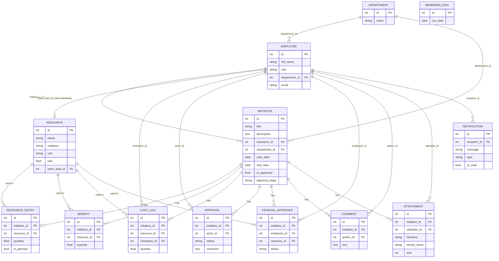

# Модель данных

Кратко и схематично: ключевые сущности, их поля и связи. Имена — как в `backend/app/models.py`
(SQLAlchemy, SQLite). Один backend-процесс, без отдельного слоя миграций (см. `migrations.py`).

## Диаграмма

`REMINDER_RUN` не связана ни с чем — это просто отметка «в этот календарный день напоминания уже
разосланы» (см. `PRODUCT_OVERVIEW.md`, раздел 5).

## Сущности вкратце

| Сущность | Что это | Ключевые связи |
|---|---|---|
| **Department** | Подразделение | ← Employee, ← Initiative |
| **Employee** | Сотрудник; `role` = champion/head/pm/top/teamlead | → Department; ← Initiative (чемпион), ← Resource (team_lead) |
| **Resource** | Специализация человеческих ресурсов или технический ресурс; `category` = human/tech, `rate` — ₽/ед. | → Employee (team_lead, только для human) |
| **Initiative** | Инициатива: заявка + текущий статус цепочки согласования (`is_approved`, `approval_stage`) | → Employee (champion), → Department; ← всё остальное ниже |
| **ResourceEntry** | Одна строка плановых ресурсов инициативы («Человеко-часы» / «Плановые технические ресурсы»); `is_planned` отличает план от факта | → Initiative, → Resource |
| **Benefit** | Одна строка ожидаемой выгоды («Ожидаемая выгода») | → Initiative, → Resource |
| **CostLog** | Запись фактически потраченных часов | → Initiative, → Resource, → Employee (champion) |
| **Approval** | Запись в истории согласований (одно решение: approved/rejected/revision) | → Initiative, → Employee (actor) |
| **PendingApprover** | Кто именно должен согласовать инициативу на текущем круге TeamLead-этапа | → Initiative, → Employee, → Resource |
| **Comment** | Комментарий к карточке инициативы | → Initiative, → Employee (author) |
| **Attachment** | Прикреплённый файл (сам файл — на диске в `DATA_DIR/attachments/`) | → Initiative, → Employee (uploader) |
| **Notification** | Уведомление сотруднику (`type` = info/reminder) | → Employee (recipient) |
| **ReminderRun** | Отметка «напоминания за эту дату уже отправлены» | — |

## Что стоит помнить

- **Initiative — центр модели**: почти все остальные сущности (кроме Department/Employee/Resource)
  существуют только в привязке к конкретной инициативе и удаляются каскадно вместе с ней.
- **Employee — единственная сущность с ролями**: одна таблица на все пять ролей, разделение
  поведения — на уровне приложения (`role`), не отдельными таблицами.
- **Resource — общий на весь портал справочник**, а не часть инициативы: ставка (`rate`) и
  привязка TeamLead-а (`team_lead_id`) меняются глобально и сразу влияют на все инициативы,
  которые этот ресурс используют.
- **ResourceEntry vs Benefit vs CostLog** — три разных «среза» вокруг одной пары
  (Initiative, Resource): план (`ResourceEntry.is_planned=True`), ожидаемая выгода (`Benefit`),
  факт (`CostLog`, только человеческие ресурсы).
- **Approval — история (append-only), PendingApprover — текущее состояние.** Approval никогда не
  удаляется (аудит); PendingApprover пересоздаётся заново на каждом круге согласования.
